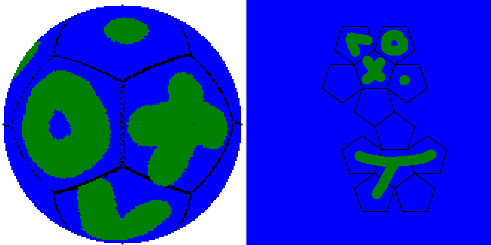

# Sphere Renderer

A trial project, used to teach math focused advanced programming paradigms.

Used to educate students mainly during the [Mathezirkel](https://www.uni-augsburg.de/de/fakultaet/mntf/math/einricht/mathezirkel/) of the University of Augsburg.

# How it works:

The right net of the dodecahedron can be drawn on with the right mouse button.

Pressing `Enter` on the keyboard renders the image drawn onto the net on the surface of a sphere on the left side.

This should look something like this:



The mathematical concept behind this is called [Geodesic polyhedron](https://en.wikipedia.org/wiki/Geodesic_polyhedron).

# Quickstart

To get this to run, you need [Python](https://www.python.org/) working on your System and the packages `numpy`, `tkinter` and `PIL` installed.
Google is your friend.

Then clone the repository into a folder on your System and run

```cmd
python3 main.py
```

in a terminal inside this folder.

# Configuration

Because this was whipped up in a state of constant having-no-time-for-anything, this is very unoptimized.
But this also is kind of necessary for it to be simple enough to go over with students with little coding experience.
Therefore (and because Python) it is terribly slow.

To get better resolution at the drawback of slower rendering time, the sphere radius in pixels and the pixel size can be configured at the `Variables for configuration` section at the top of the `main.py` file.
Just modifiy the values there and try what works.

# Contribution

I kind of need this unoptimized for it to be presentable as a lesson.
So please do not try to make it faster or prettier.

If you have Ideas for nice quality-of-life features, that would improve the `teachability`, feel free to open pull requests.

(At the moment I think it would be a very teachable thing to look into turning of the sphere, I will maybe look into this in the future (Also, as the backside of the sphere currently is not rendered... BUT it would be, so that is not a technical limitation, there is just no way to TURN it, so that it would become visible, thats the problem))
